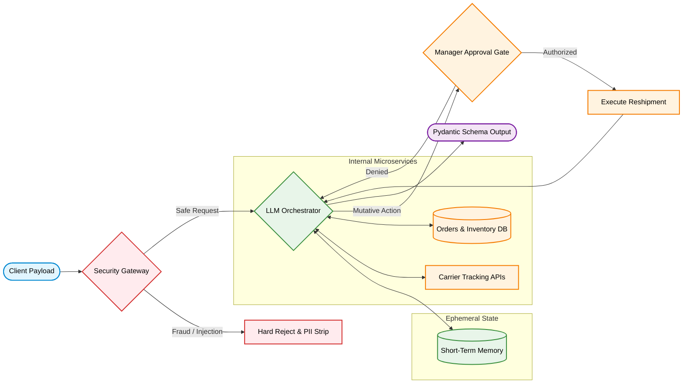

<div align="center">
  <h1>LogiTrack AI</h1>
  <p><b>Enterprise Autonomous Logistics Support Agent</b></p>
  
  [](https://www.python.org/)
  [](https://www.langchain.com/)
  [](https://opensource.org/licenses/MIT)
</div>

<br>

## 1. Project Overview

LogiTrack AI is a production-grade autonomous logistics agent built on **LangChain** and **LangGraph**. It is designed to autonomously handle complex customer inquiries in fulfillment operations by treating Large Language Models (LLMs) purely as routing engines rather than state manipulators. 

By enforcing strict data governance, active threat mitigation, and programmatic Human-in-the-Loop (HITL) checkpoints, LogiTrack ensures that every mutative action taken by the AI is authorized, audited, and strictly deterministic.

---

## 2. System Architecture

The architecture relies on strict boundaries between Security, LLM Orchestration, and Business Logic. 



---

## 3. Core Features

### 3.1. Zero-Trust Security Gateway
All incoming user requests pass through a pre-execution middleware layer. Malicious instruction-override attempts (prompt injections) and identified fraud profiles are hard-rejected at the boundary edge, consuming zero compute resources or LLM tokens.

### 3.2. Data Masking and Compliance
A dedicated `PIIMiddleware` automatically intercepts and redacts Personally Identifiable Information (such as customer emails) from the conversation history before it is committed to logs or short-term memory, ensuring compliance with data privacy standards.

### 3.3. Human-in-the-Loop (HITL) 
While read-only actions (checking stock or tracking a package) run autonomously, high-risk mutative actions (dispatching high-value reshipments) trigger an asynchronous state interrupt. The execution state is paused and only resumes upon explicit authorization from a human manager.

### 3.4. Fault Tolerance and Determinism
Carrier APIs frequently experience timeouts. The system utilizes `ToolRetryMiddleware` with exponential backoff to handle transient network errors gracefully. Furthermore, to prevent LLM hallucinations, all egress payloads are strictly typed into Pydantic models (`ShipmentResolution`).

---

## 4. Setup and Installation

### Prerequisites
*   **Python 3.10+** installed on your system.
*   **Google Gemini API Key** (or an equivalent provider configured via LangChain).

### Installation Steps

**1. Clone the repository:**
```bash
git clone https://github.com/AZMSharif/Field_work_Task-3.git
cd Field_work_Task-3/LogiTrack-AI
```

**2. Install dependencies:**
```bash
pip install -U "langchain[google-genai]" langgraph python-dotenv pydantic
```

**3. Configure Environment:**
Create a `.env` file at the root of the `LogiTrack-AI` folder:
```env
GEMINI_API_KEY=your_gemini_api_key_here

# (Optional) Tracing Configuration for UI Observability
LANGCHAIN_TRACING_V2=true
LANGCHAIN_ENDPOINT=https://api.smith.langchain.com
LANGCHAIN_API_KEY=your_langsmith_api_key
LANGCHAIN_PROJECT=LogiTrack-AI
```

---

## 5. Execution

To validate the deterministic behavior of the agent across memory isolation, fault tolerance, and security vectors, execute the integrated test harness:

```bash
python demo.py
```

### File Structure Map
*   `agent.py`: LangChain execution graph, middleware stack, and strict output schemas.
*   `tools.py`: Internal system wrappers and APIs the agent can autonomously invoke.
*   `guardrails.py`: Security middleware for evaluating and rejecting malicious payloads.
*   `logistics_data.py`: Mock persistence layer simulating databases for claims and inventory.
*   `demo.py`: The integration testing harness validating all scenarios end-to-end.
